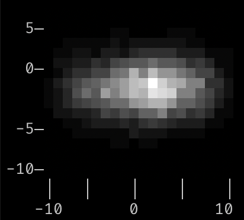
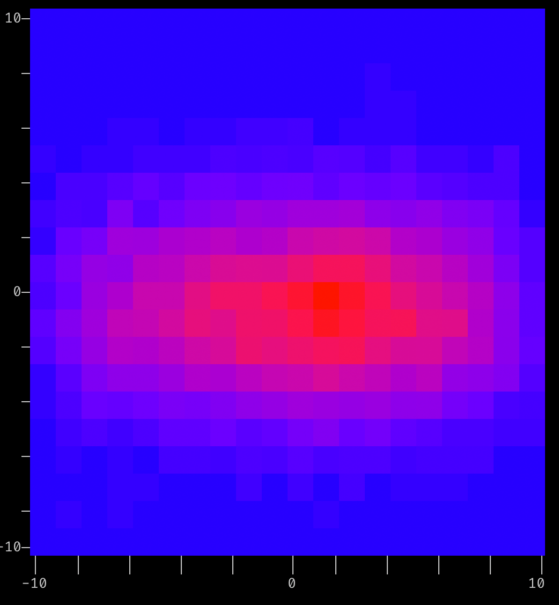

<h1 align="center">densitty</h1>
<h2 align="center"> Terminal-based 2-D Histogram, Density Plots, and Heatmaps</h2>

Generate 2-D histograms (density plots, heat maps, eye diagrams) similar to [matplotlib's hist2d](https://matplotlib.org/stable/gallery/statistics/hist.html "hist2d"), but with output in the terminal, and no external dependencies.

## Examples
Given a list of points:

```python
import random
points = [(random.triangular(-10, 10, 2), random.gauss(-1, 2)) for _ in range(10000)]
```

#### Generate a 2-D Histogram:
```python
from densitty.binning import bin_data
from densitty.plot import Plot

binned, _, _ = bin_data(points, (1,1))
Plot(binned).show()
```
Output:


#### Add some axes:
```python

binned, x_axis, y_axis = bin_data(points, (1,1))

p = Plot(binned, x_axis=x_axis, y_axis=y_axis)
p.show()
```


#### Specify explicit boundaries for the binning, and scale up the output size to 60x60
```python
binned, x_axis, y_axis = bin_data(points, (1,1), ranges=((-10,10), (-10,10)))
p = Plot(binned, x_axis=x_axis, y_axis=y_axis)
p.upscale((60,60)).show()
```



#### Bin with a finer bin size, use terminal-capability detection to pick a colormap, add border lines to axes:
```python
from densitty.detect import plot

binned, x_axis, y_axis = bin_data(points, (.25, .25), ranges=((-10,10), (-10,10)), border_line=True)
plot(binned, x_axis, y_axis).show()
```


#### A PAM-4 Eye Diagram

```python
eye_data = eye(96, 96, signal_levels=(-0.75, -0.25, 0.25, 0.75))
x_axis = Axis((-1, 1), border_line=True)
y_axis = Axis((-300, 300), border_line=True)
eye_plot = plot(eye_data, x_axis=x_axis, y_axis=y_axis)
eye_plot.show()
```


## Sub-modules / Usage Notes
Note: Densitty is designed to be small and not have external dependencies. If it is still too large to be used in your code, you can likely just use the "plot.py" file with some small modifications to remove the dependencies caused by the type checker. If you're taking this approach, please open an issue to let me know that this is an important consideration.

### Plot class (`plot.py`)
You will need to instantiate a Plot object, either directly through the class constructor, or via a helper function (e.g. in detect.py).
The data to be plotted must be provided. Rendering options (color map, characters to use, the data range, the Axes) may be optionally specified.

### Axis class (`axis.py`)
Providing an Axis object for your X and Y axes lets you specify the range of each axis, whether tick marks and labels should correspond to the bins themselves or the bin edges, and some axis rendering details. You may provide a set of labels to be used on the axis, or have them be autogenerated for you.

### Colors
#### Truecolor / RGB/ 24-bit color
Several 24-bit color maps are provided in `truecolor.py`, for use with terminals that support it. If you want to specify your own 24-bit color map, the included `colormap24b()` function is a straightforward way to interpolate between provided colors to produce a color map. Interpolation is done in L*a*b* color space to preserve brightness and avoid the "muddy" colors seen when interpolating directly in RGB.

#### 256-color / 16-color
Non-truecolor "ANSI" color maps are provided in `ansi.py`, for both 256-color-capable terminals as well as minimally color supporting 16-color.

#### ASCII-art
For terminals that don't support colors, or for that old-school look, `ascii_art.py` has some "color maps" using just character density.

### Binning
`binning.py` provides utility functions to bin a list of (X,Y) values into a dataset suitable for plotting with the `Plot` class.
`bin_data()` takes the bin sizes as arguments,
`bin_pick_num_bins()` allows you to specify the number of bins, and
`bin_edges()` can be used if you want to specify each of the X/Y bin edge values.

### Terminal Capability Detection
`detect.py` has utility routines to try to detect the current terminal's capabilities. These routines are leveraged in two helper functions: `pick_colormap()` will pick between supplied colormaps based on the terminal's capabilities, and `plot()` is a wrapper for the `Plot` class constructor that uses `pick_colormap()` to pick the appropriate colormap.

This provides a simple mechanism to try to use the nicest colors supported by the current terminal:
```
from densitty.detect import GRAYSCALE, plot

...

plot(my_data, colors=GRAYSCALE, x_axis=my_x_axis, y_axis=my_y_axis)
```
will use truecolor, 256-color, or ASCII-art as possible with the current terminal.

## API
TODO
