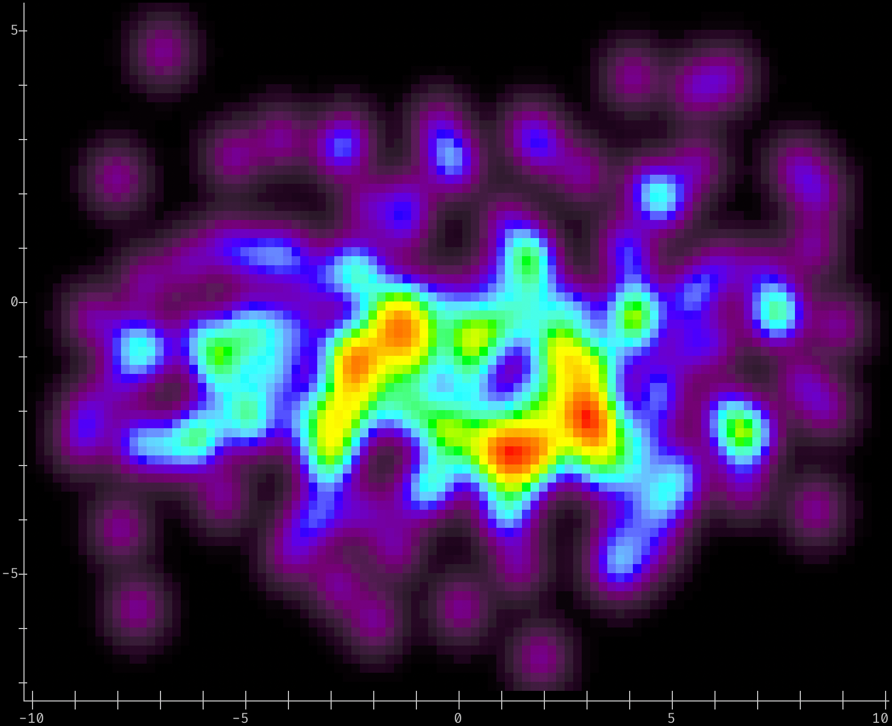
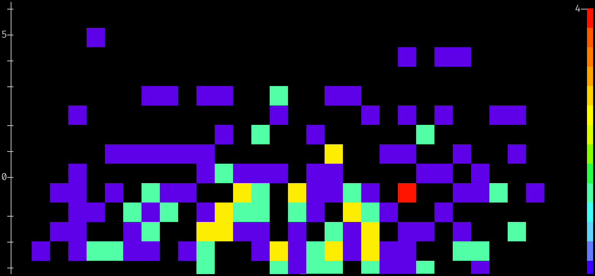
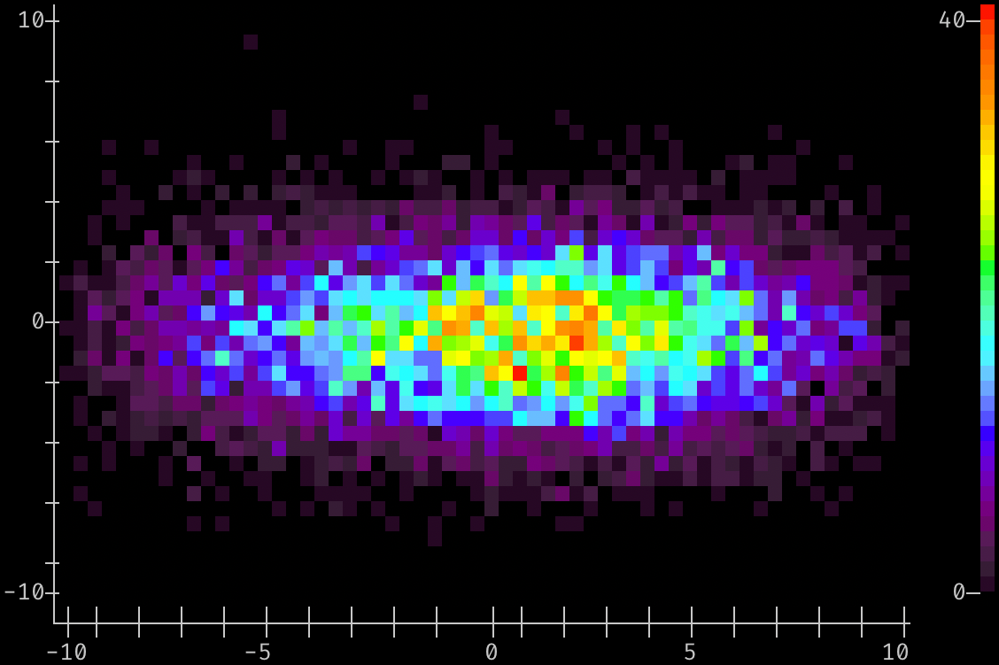
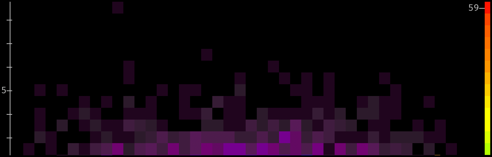
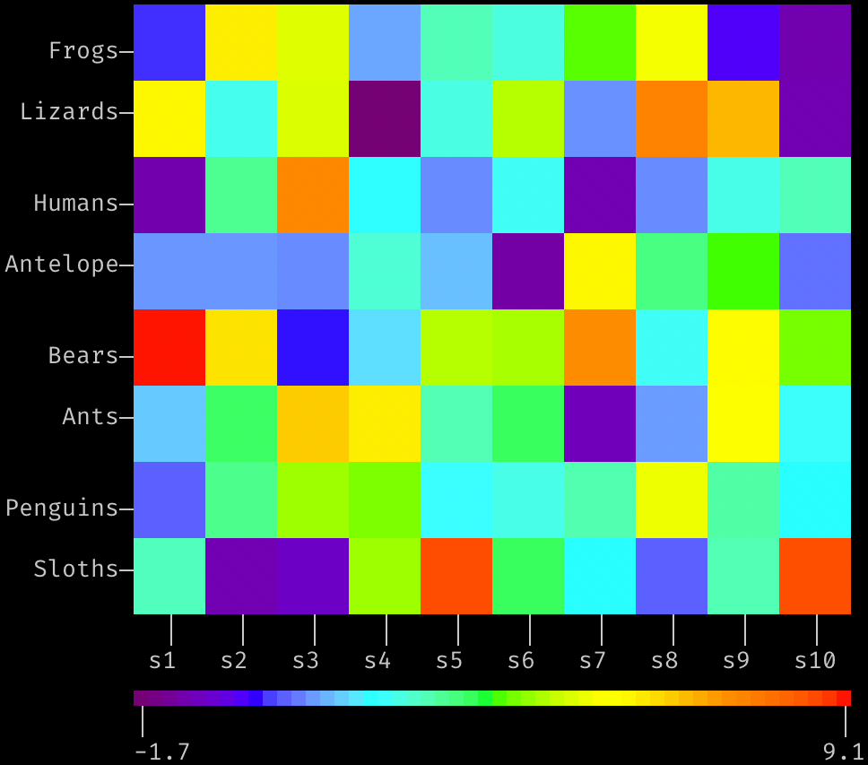
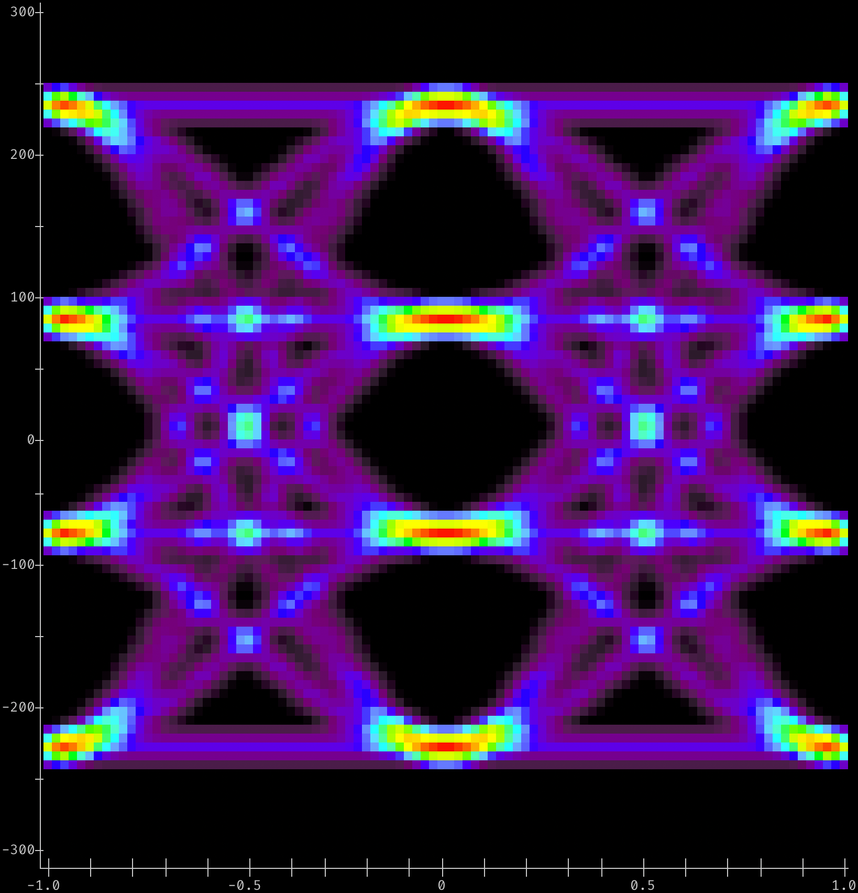

Given a list of points:

```python
import random
points = [(random.triangular(-10, 10, 2), random.gauss(-1, 2)) for _ in range(10000)]
```
##  Generate a 2-D Density plot sized to screen width, default colors & plot/axis options
```python
# Use 'densityplot2d' to pick color map based on terminal capabilities, pick a smoothing kernel
# to use, and make a density plot with the plot size determined by the terminal window's width:
#
# Only use 200 data points, to highlight the difference between densityplot and histogram.
from densitty import densityplot2d

densityplot2d(points[:200]).show()
```


##  Generate a 2-D Histogram with 30x20 bins
```python
# Use 'histplot2d()'  to pick color map based on terminal capabilities, bin the
# points into 30 X, 20 Y bins, scaling to 4 'pixels' per bin in X and Y

from densitty import histplot2d

histplot2d(points[:200], (30,20), scale=4, colorscale=True).show()
```


##  Generate a 2-D Histogram of more points with 60x40 bins
```python
# Bin all of the points with an explicit bin size (rather than number of bins), and plot the
# result as a 2-D histogram:
from densitty import histplot2d

histplot2d(points, (60,40), scale=2, colorscale=True).show()
```


##  Generate a 2-D Histogram with fixed-size bins
```python
from densitty import histplot2d

# Bin the points with an explicit bin size of 0.5
# rather than number or location. Since we don't provide a range for each axis, the
# range of data values is used
p = histplot2d(points, bin_size=0.5)
p.upscale().show()
```


##  Generate a Grid-style heatmap with user-specified labels
```python
# random values for the heatmap, in 10x8 grid
values = [[random.triangular(-2, 10, 1) for _ in range(10)] for _ in range(8)]

from densitty import grid_heatmap, make_colorbar

plt = grid_heatmap(values,
                   x_labels=[f"s{i}" for i in range(1,11)],
                   y_labels=["Frogs", "Lizards", "Humans", "Antelope", "Bears", "Ants", "Penguins", "Sloths"],
                   )
plt.show()
# add a color scale based on the plot data, indented by the plot's left margin:
scale = make_colorbar(plt, label_fmt="{:0.2}")
scale.show(prefix=" " * plt.left_margin())
```


##  A PAM-4 Eye Diagram
```python
from densitty.detect import plot
from densitty.axis import Axis
# For e.g. PAM-4 Ethernet voltage vs fractional-UI data
# Given eye data in a list-of-lists-of-floats "array" named eye_data
# construct axes given the min/max of the bins along X and Y axes
# and plot
x_axis = Axis((-1, 1), border_line=True)
y_axis = Axis((-300, 300), border_line=True)
eye_plot = plot(eye_data, x_axis=x_axis, y_axis=y_axis)
eye_plot.show()
```


